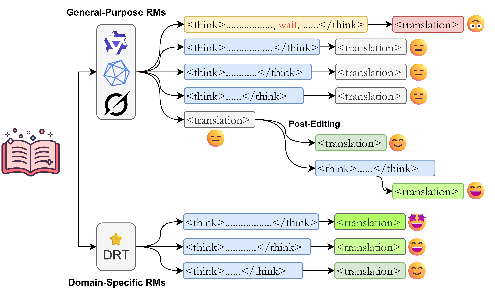

# Test-Time Scaling of Reasoning Models for Machine Translation

[](https://arxiv.org/abs/2510.06471)

This is the official repository for the paper **"Test-Time Scaling of Reasoning Models for Machine Translation"** accepted at EACL 2026.

## 📄 Abstract

>Test-time scaling (TTS) has enhanced the performance of Reasoning Models (RMs) on various tasks such as math and coding, yet its efficacy in machine translation (MT) remains underexplored. This paper investigates whether increased inference-time computation improves translation quality. We evaluate 12 RMs across a diverse suite of MT benchmarks spanning multiple domains, examining three scenarios: direct translation, forced-reasoning extrapolation, and post-editing. Our findings show that for general-purpose RMs, TTS provides limited and inconsistent benefits for direct translation, with performance quickly plateauing. However, the effectiveness of TTS is unlocked by domain-specific fine-tuning, which aligns a model's reasoning process with task requirements, leading to consistent improvements up to an optimal, self-determined reasoning depth. We also find that forcing a model to reason beyond its natural stopping point consistently degrades translation quality. In contrast, TTS proves highly effective in a post-editing context, reliably turning self-correction into a beneficial process. These results indicate that the value of inference-time computation in MT lies not in enhancing single-pass translation with general models, but in targeted applications like multi-step, self-correction workflows and in conjunction with task-specialized models.
>
>Our findings show that:
>- We demonstrate that for general-purpose RM, TTS provides limited and inconsistent benefits for direct machine translation.
>- We show that the effectiveness of TTS is unlocked by domain-specific fine-tuning, which aligns the model’s reasoning process with task requirements.
>- We find that forcing a model to reason by inserting a single `wait` beyond its natural stopping point consistently degrades translation quality, highlighting the importance of the model's intrinsic deliberation process.
>- We establish that TTS is highly effective in a post-editing context, in which the inference cost is higher than the cost of direct translation. TTS turns self-correction into a reliably beneficial process.

<p align="center">
  
</p>

## 🔧 Installation

```bash
git clone https://github.com/your-username/rm4mt.git
cd rm4mt

uv sync
```

## 📁 Repository Structure

```
rm4mt/
├── rm4mt_eval/                # Evaluation scripts
│   ├── eval_qwen.py           # Qwen3 model evaluation
│   ├── eval_cogito.py         # Cogito model evaluation
│   ├── eval_drt.py            # DRT model evaluation
│   ├── eval_api_*.py          # API-based model evaluation (Grok, Qwen)
│   ├── post_editing_qwen.py   # Post-editing experiments
│   ├── compute_comet.py       # COMET score computation
│   ├── compute_gea.py         # GEA metric computation
│   ├── compute_grb_grf.py     # GRB/GRF metric computation
│   └── analysis/              # Analysis notebooks and figures
│
├── pyproject.toml             # Project dependencies
└── README.md
```

## 🚀 Usage

### Model Evaluation

#### Direct Translation with Thinking Budget Control

```bash
cd rm4mt_eval

# Evaluate Qwen3 models with different thinking budgets
bash submit_all_qwen.sh

# Evaluate Cogito models
bash submit_all_cogito.sh

# Evaluate DRT (Deep Reasoning Translation) models
bash submit_all_drt.sh
```

#### API-based Model Evaluation

```bash
# Evaluate via API (Grok-3-Mini)
bash submit_all_api_grok.sh
```

#### Post-Editing Experiments

```bash
bash submit_all_post_editing_qwen.sh
```

### Metric Computation

```bash
# Compute COMET scores
bash compute_comet.sh

# Compute GEA (Gemini Evaluation with Anchors) scores
bash compute_gea.sh

# Compute GRB (Gemini Reference Based) and GRF (Gemini Reference-Free) scores
bash compute_grb_grf.sh
```

## 📊 Evaluated Models

- [Qwen3](https://qwenlm.github.io/blog/qwen3/)-(0.6, 1.7, 4, 8, 14, 32)B
- [Cogito](https://www.deepcogito.com/research/cogito-v1-preview)-(3, 8)B
- [DRT](https://huggingface.co/collections/Krystalan/deep-reasoning-translation)-(7, 8, 14)B
- [Grok-3-Mini](https://docs.x.ai/docs/guides/reasoning#reasoning) 


## 📖 Citation

If you find this work useful, please cite our paper:

```bibtex
@inproceedings{li2026tts-mt,
  title={Test-Time Scaling of Reasoning Models for Machine Translation},
  author={Li, Zihao and Ji, Shaoxiong and Tiedemann, J{\"o}rg},
  booktitle={Proceedings of the 2026 Conference of the European Chapter of the Association for Computational Linguistics},
  year={2026}
}
```

## 🙏 Acknowledgments

The work has received funding from the Digital Europe Programme under grant agreement No 101195233 (OpenEuroLLM). 
The authors wish to acknowledge CSC - IT Center for Science, Finland, and LUMI supercomputers, owned by the EuroHPC Joint Undertaking, for providing computational resources.


## 📧 Contact

For questions or issues, please open an issue on GitHub or contact:
- Zihao Li: zihao.li@helsinki.fi
